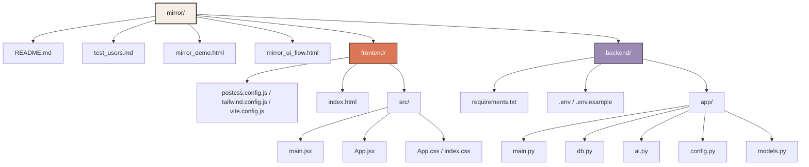

# Codebase Architecture Graph

This document details the file structure, component interactions, and data/AI pipeline flow for the **Mirror — AI for Self-Inquiry** application.

---

## 1. Project Directory Structure

Here is the visual structure of the project files, including links to main components:

---

## 2. Dynamic Interaction & Data Flow Graph

This graph models the communication channels between the Client application, API Controllers, Supabase Database, and Google Gemini API models:

```mermaid
flowchart TB
    %% Nodes
    subgraph Client ["Frontend Client App.jsx"]
        UI["React Component UI State"]
        Switch["Developer Profile Switcher"]
    end

    subgraph API ["FastAPI Web Router main.py"]
        direction TB
        R_Prof["/api/profile (GET)"]
        R_Jour["/api/journals (GET/POST)"]
        R_Chat["/api/chats (GET/POST)"]
        R_Obs["/api/observations (GET/POST)"]
        R_Map["/api/attachment-map (GET)"]
    end

    subgraph AI ["AI Engine Layer ai.py"]
        direction LR
        GeminiClient["Gemini SDK Client"]
        AgentC["Conscious Agent (The Therapist)"]
        AgentU["Unconscious Agent (The Mirror)"]
        Tagging["Journal Tagging Pipeline"]
    end

    subgraph DB ["Database Client Layer db.py"]
        direction TB
        SupaAPI["Supabase Client API"]
        MockDB["MockSupabaseClient (Local Fallback)"]
    end

    %% Interactions
    UI -->|API Request| API
    Switch -->|Set x-user-id Header| API

    %% Routing to DB & AI
    R_Prof -->|Fetch Profile| DB
    
    R_Jour -->|1. Generate Tags| Tagging
    Tagging -->|2. Save Journal + Tags| DB
    R_Jour -->|3. Update Stats| R_Map
    
    R_Chat -->|1. Save User Msg| DB
    R_Chat -->|2. Request Socratic Response| AgentC
    AgentC -->|3. Save Therapist Msg| DB
    
    R_Obs -->|Trigger pipeline / Save feedback| DB
    R_Obs -->|Request pipeline generation| AgentU
    
    %% AI to Gemini API Integration
    AgentC -.->|gemini-2.5-flash| GeminiClient
    AgentU -.->|gemini-2.5-flash| GeminiClient
    Tagging -.->|gemini-2.5-flash| GeminiClient

    %% DB Selection
    DB --> SupaAPI
    DB -.->|Fallback if keys missing| MockDB

    %% Click mappings
    click UI href "file:///C:/Users/Rald999/Documents/GitHub/mirror/frontend/src/App.jsx#L22"
    click R_Prof href "file:///C:/Users/Rald999/Documents/GitHub/mirror/backend/app/main.py#L38"
    click R_Jour href "file:///C:/Users/Rald999/Documents/GitHub/mirror/backend/app/main.py#L102"
    click R_Chat href "file:///C:/Users/Rald999/Documents/GitHub/mirror/backend/app/main.py#L151"
    click R_Obs href "file:///C:/Users/Rald999/Documents/GitHub/mirror/backend/app/main.py#L217"
    click AgentC href "file:///C:/Users/Rald999/Documents/GitHub/mirror/backend/app/ai.py#L22"
    click AgentU href "file:///C:/Users/Rald999/Documents/GitHub/mirror/backend/app/ai.py#L127"
    click Tagging href "file:///C:/Users/Rald999/Documents/GitHub/mirror/backend/app/ai.py#L75"
    click MockDB href "file:///C:/Users/Rald999/Documents/GitHub/mirror/backend/app/db.py#L87"
    
    %% Aesthetics
    classDef clientStyle fill:#faf6ef,stroke:#d97757,stroke-width:2px;
    classDef apiStyle fill:#faf6ef,stroke:#9b8bb4,stroke-width:2px;
    classDef aiStyle fill:#0e0d1a,stroke:#c7bcd9,stroke-width:2px,color:#fff;
    classDef dbStyle fill:#faf6ef,stroke:#6b655b,stroke-width:2px;
    
    class UI,Switch clientStyle;
    class R_Prof,R_Jour,R_Chat,R_Obs,R_Map apiStyle;
    class GeminiClient,AgentC,AgentU,Tagging aiStyle;
    class SupaAPI,MockDB dbStyle;
```

---

## 3. The Dual-Agent AI Architecture

The application implements attachment-theory analysis by isolating the AI system into two distinct behaviors:

| Module / Agent Role | Technical Trigger / Interface | Gemini Context & Prompt Blueprint | Focus Area |
| :--- | :--- | :--- | :--- |
| **Conscious Agent** *("The Therapist")* | `POST /api/chats` [generate_therapist_response](file:///C:/Users/Rald999/Documents/GitHub/mirror/backend/app/ai.py#L22) | **System Prompt**: Warm, Socratic, attachment-informed wellness companion. **Context**: Direct chat history. **Length**: 1-3 sentences + reflective question. | Conscious exploration, validation, empathetic active listening. |
| **Unconscious Agent** *("The Mirror")* | `POST /api/observations/generate` [generate_weekly_observations](file:///C:/Users/Rald999/Documents/GitHub/mirror/backend/app/ai.py#L127) | **System Prompt**: Unconscious layer of self; direct, objective, and unflinchingly honest. **Context**: All journals + chat history. **Format**: Structured JSON returning quote and evidence logs. | Linguistic omissions, avoided topics, naming shifts, anxiety patterns. |

---

## 4. Key Code Entries & Symbols

### Backend Python API

*   **API Router Configuration**: [app/main.py](file:///C:/Users/Rald999/Documents/GitHub/mirror/backend/app/main.py)
    *   [get_profile](file:///C:/Users/Rald999/Documents/GitHub/mirror/backend/app/main.py#L38): Fetches current user metadata and attachment style description.
    *   [create_journal](file:///C:/Users/Rald999/Documents/GitHub/mirror/backend/app/main.py#L102): Analyzes journal entries, tags content via [ai.py](file:///C:/Users/Rald999/Documents/GitHub/mirror/backend/app/ai.py), and updates statistics.
    *   [create_chat](file:///C:/Users/Rald999/Documents/GitHub/mirror/backend/app/main.py#L151): Appends messages to chat log and retrieves therapist response.
    *   [generate_mirror_observations](file:///C:/Users/Rald999/Documents/GitHub/mirror/backend/app/main.py#L217): Aggregates user logs to prompt the Unconscious agent.
*   **Database Connectivity fallback**: [app/db.py](file:///C:/Users/Rald999/Documents/GitHub/mirror/backend/app/db.py)
    *   [MockSupabaseClient](file:///C:/Users/Rald999/Documents/GitHub/mirror/backend/app/db.py#L87): Mock database container containing hardcoded initial states for 5 developer profiles.
    *   [MockQueryBuilder](file:///C:/Users/Rald999/Documents/GitHub/mirror/backend/app/db.py#L8): Chainable helper representing basic `select()`, `eq()`, `insert()`, and `update()` operations.
*   **AI Integration & Prompt Systems**: [app/ai.py](file:///C:/Users/Rald999/Documents/GitHub/mirror/backend/app/ai.py)
    *   [generate_therapist_response](file:///C:/Users/Rald999/Documents/GitHub/mirror/backend/app/ai.py#L22): Formats history and calls `gemini-2.5-flash` with Therapist instructions.
    *   [generate_journal_tags](file:///C:/Users/Rald999/Documents/GitHub/mirror/backend/app/ai.py#L75): Performs zero-shot JSON tag parsing.
    *   [generate_weekly_observations](file:///C:/Users/Rald999/Documents/GitHub/mirror/backend/app/ai.py#L127): Formats aggregated history and prompts The Mirror agent.

### Frontend React Application

*   **Vite Setup and Entry Point**: [main.jsx](file:///C:/Users/Rald999/Documents/GitHub/mirror/frontend/src/main.jsx)
*   **Single-Page Router and Screen Controllers**: [src/App.jsx](file:///C:/Users/Rald999/Documents/GitHub/mirror/frontend/src/App.jsx)
    *   `TEST_USERS`: Predefined list of users for attachment style toggling.
    *   `fetchUserData`: Queries backend endpoints on switch.
    *   `saveJournal` / `sendChatMessage`: Captures user logs and integrates replies.
    *   `generateMirrorObservations`: Handles loading states during Unconscious agent generation.
